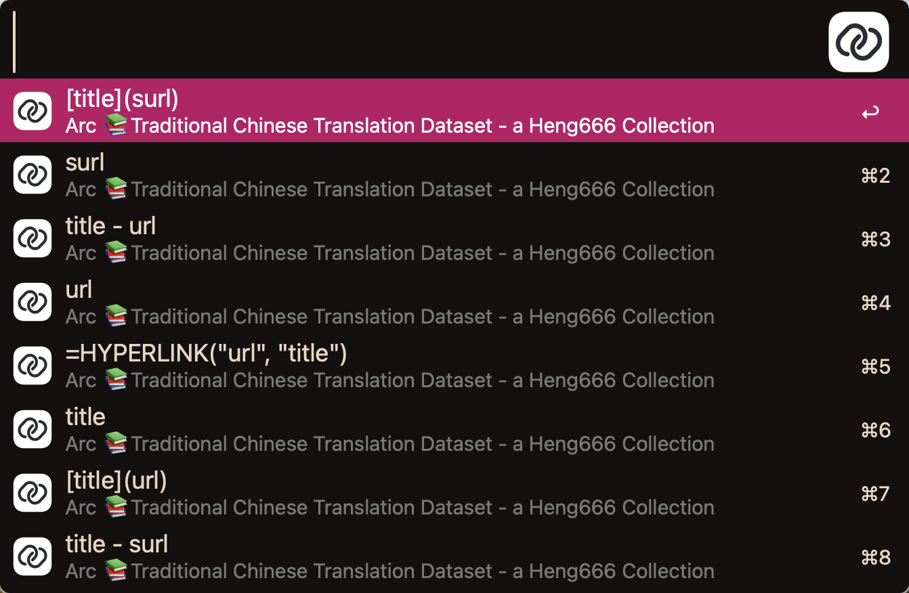

# Alfred Copy Title URL
> Copy the title and URL with ease

[](https://github.com/cage1016/alfred-copy-title-url/actions/workflows/release.yml)
[](https://lbesson.mit-license.org/)


## Installation
Visit the [Releases](https://github.com/cage1016/alfred-copy-title-url/releases) and download the latest version.

## Usage



### Supported patterns
You might add a custom pattern as your own pattern with the keywords (`title`, `url`, and shortened URL `surl`). The following patterns are supported by default:
```
title
[title](url)
title - url
url
surl
title - surl
[title](surl)
=HYPERLINK("url", "title")
```

## License
This project is licensed under the MIT License. See [LICENSE](LICENSE) for details.